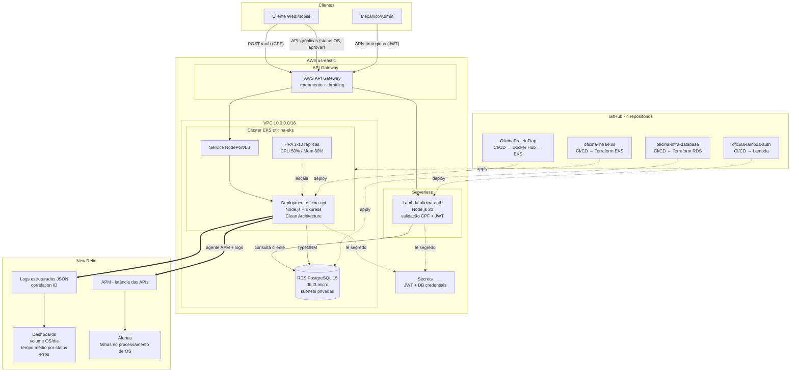

# Diagrama de Componentes — Visão de Nuvem

## Componentes

| Componente | Responsabilidade | Repositório |
|---|---|---|
| API Gateway | Porta de entrada única; roteia /auth para a Lambda e demais rotas para o EKS; throttling | oficina-infra-k8s (config) |
| Lambda oficina-auth | Autenticação por CPF: valida, consulta base, emite JWT | oficina-lambda-auth |
| EKS oficina-api | Regras de negócio: OS, clientes, veículos, estoque, execuções | OficinaProjetoFiap |
| RDS PostgreSQL | Persistência relacional gerenciada | oficina-infra-database |
| New Relic | APM, logs estruturados, dashboards e alertas | agente na aplicação |
