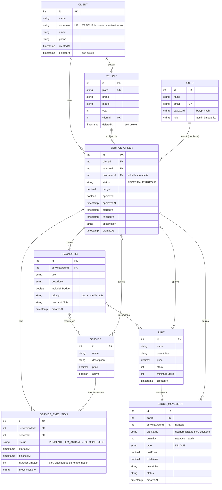

# Modelo de Dados — Diagrama ER e Justificativa

## Diagrama Entidade-Relacionamento

## Justificativa da escolha do banco relacional

O domínio da oficina é **inerentemente relacional**: uma ordem de serviço conecta cliente, veículo, mecânico, diagnósticos, serviços, peças, execuções e movimentações de estoque. As garantias que sustentam o negócio são exatamente as de um RDBMS:

1. **Integridade referencial** — uma OS nunca aponta para cliente ou veículo inexistente; FKs garantem isso no banco, não só na aplicação
2. **Transações ACID** — a aprovação do orçamento atualiza a OS, baixa estoque e cria execuções atomicamente; falha em qualquer passo reverte tudo (rollback compensatório de estoque implementado no ApproveOrderUseCase)
3. **Consultas analíticas** — os dashboards de observabilidade (volume diário de OS, tempo médio por status) são agregações SQL diretas sobre `service_orders` e `service_executions`

## Justificativa dos relacionamentos

| Relacionamento | Cardinalidade | Justificativa |
|---|---|---|
| Client → Vehicle | 1:N | Um cliente pode ter vários veículos; a placa é única no sistema |
| Client → ServiceOrder | 1:N | Histórico completo de OS por cliente |
| Vehicle → ServiceOrder | 1:N | Histórico de manutenções por veículo |
| User(mecânico) → ServiceOrder | 1:N | `mechanicId` nullable — preenchido apenas no aceite, garantindo exclusividade de atendimento |
| ServiceOrder → Diagnostic | 1:N | Uma OS pode ter múltiplos diagnósticos (problemas distintos identificados) |
| Diagnostic ↔ Service/Part | N:M | Um diagnóstico recomenda vários serviços/peças; tabelas de junção geradas pelo TypeORM |
| ServiceOrder ↔ Service/Part | N:M | Itens efetivamente **aprovados** — separados das recomendações para preservar o orçamento aprovado mesmo se diagnósticos mudarem |
| ServiceOrder → ServiceExecution | 1:N | Execução individual por serviço com timestamps para métricas de produtividade |
| Part → StockMovement | 1:N | Auditoria completa de movimentações; `partName` desnormalizado preserva histórico se a peça for renomeada |

## Decisões de modelagem

- **Soft delete** (`deletedAt`) em Client e Vehicle — atende o requisito de exclusão lógica preservando histórico de OS
- **`document` (CPF) com índice único** — é a chave de autenticação da Lambda (Fase 3); consulta O(log n)
- **`durationMinutes` materializado** em ServiceExecution — evita recálculo nas consultas dos dashboards
- **Status como string constrainada** na aplicação — enum de negócio validado nos use-cases (RECEBIDA → EM_DIAGNOSTICO → AGUARDANDO_APROVACAO → EM_EXECUCAO → FINALIZADA → ENTREGUE)

## Ajustes da Fase 3

1. **Índice em `clients.document`** — acelera a autenticação por CPF da Lambda
2. **Índice composto em `service_orders (status, createdAt)`** — otimiza a listagem ordenada
3. **Índice em `service_executions (serviceId, status)`** — otimiza cálculo de tempo médio por serviço
