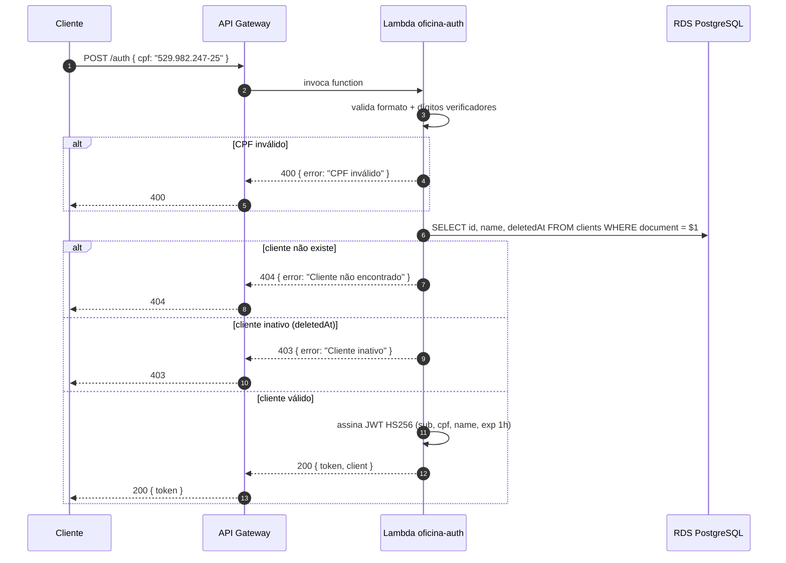
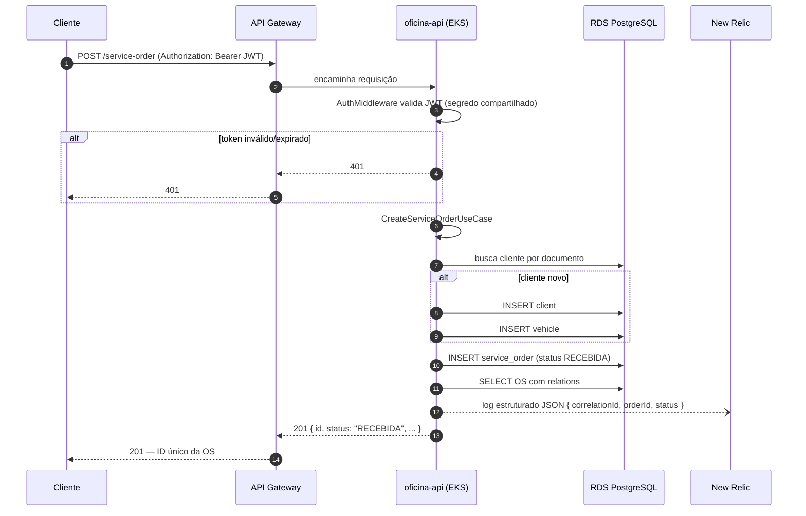

# Diagramas de Sequência

## Fluxo 1 — Autenticação por CPF

```mermaid
sequenceDiagram
    autonumber
    participant C as Cliente
    participant GW as API Gateway
    participant L as Lambda oficina-auth
    participant DB as RDS PostgreSQL

    C->>GW: POST /auth { cpf: "529.982.247-25" }
    GW->>L: invoca function
    L->>L: valida formato + dígitos verificadores
    alt CPF inválido
        L-->>GW: 400 { error: "CPF inválido" }
        GW-->>C: 400
    end
    L->>DB: SELECT id, name, deletedAt FROM clients WHERE document = $1
    alt cliente não existe
        L-->>GW: 404 { error: "Cliente não encontrado" }
        GW-->>C: 404
    else cliente inativo (deletedAt)
        L-->>GW: 403 { error: "Cliente inativo" }
        GW-->>C: 403
    else cliente válido
        L->>L: assina JWT HS256 (sub, cpf, name, exp 1h)
        L-->>GW: 200 { token, client }
        GW-->>C: 200 { token }
    end
```

## Fluxo 2 — Abertura de Ordem de Serviço (rota protegida)

```mermaid
sequenceDiagram
    autonumber
    participant C as Cliente
    participant GW as API Gateway
    participant API as oficina-api (EKS)
    participant DB as RDS PostgreSQL
    participant NR as New Relic

    C->>GW: POST /service-order (Authorization: Bearer JWT)
    GW->>API: encaminha requisição
    API->>API: AuthMiddleware valida JWT (segredo compartilhado)
    alt token inválido/expirado
        API-->>GW: 401
        GW-->>C: 401
    end
    API->>API: CreateServiceOrderUseCase
    API->>DB: busca cliente por documento
    alt cliente novo
        API->>DB: INSERT client
        API->>DB: INSERT vehicle
    end
    API->>DB: INSERT service_order (status RECEBIDA)
    API->>DB: SELECT OS com relations
    API--)NR: log estruturado JSON { correlationId, orderId, status }
    API-->>GW: 201 { id, status: "RECEBIDA", ... }
    GW-->>C: 201 — ID único da OS
```
